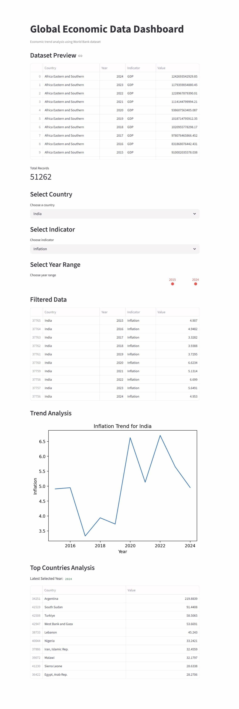

# 📊 Web Data Extraction & Trend Analysis Dashboard

## 🚀 Project Overview

This project demonstrates a complete **data analytics ETL pipeline** that extracts global economic indicators from publicly available data sources and converts them into meaningful insights through an interactive dashboard.

Using Python-based data processing, the system collects macroeconomic indicators such as GDP, population, inflation, and unemployment and visualizes trends across countries and time periods.

The project replicates a **real-world analytics workflow used in data-driven organizations**.

---

## 🎯 Business Objective

Economic indicators are often distributed as large datasets that are difficult to analyze manually.

This project demonstrates how automated data extraction and visualization can help analysts:

- Monitor global economic trends  
- Compare economic indicators across countries  
- Identify patterns in macroeconomic data  
- Transform raw data into actionable insights  

---

## 🔴 Data Analytics Workflow

```
🔗 External Data Source (World Bank API)
              ↓
📥 Data Extraction using Python
              ↓
📊 Structured Dataset Creation
              ↓
🧹 Data Cleaning & Preparation
              ↓
📈 Exploratory Data Analysis
              ↓
🖥 Interactive Visualization Dashboard
```

### 1️⃣ External Data Source  
The project collects global economic indicators such as GDP, population, inflation, and unemployment from the **World Bank Open Data API**.  
This API provides publicly available economic data for many countries and years.

---

### 2️⃣ Data Extraction using Python  
📄 **File Used:** `collect_data.py`

A Python script sends requests to the World Bank API and retrieves economic data for different countries and indicators.

The script automatically downloads the raw data in JSON format from the API.

---

### 3️⃣ Structured Dataset Creation  
📄 **File Used:** `collect_data.py`  
📄 **Output File:** `world_economic_data.csv`

After extracting the data from the API, the script converts the raw data into a structured table format.

The dataset includes columns such as:

- Country  
- Year  
- Indicator  
- Value  

This structured dataset is then saved as a CSV file.

---

### 4️⃣ Data Cleaning & Preparation  
📄 **File Used:** `app.py`

Before analysis, the dataset is cleaned to ensure accurate results.

Typical steps include:

- Removing missing values  
- Converting year values to numeric format  
- Organizing the dataset for filtering and analysis

This step prepares the dataset for visualization.

---

### 5️⃣ Exploratory Data Analysis  
📄 **File Used:** `app.py`

Basic analysis is performed on the dataset to understand economic trends.

Examples include:

- Comparing indicators across countries  
- Filtering data by year range  
- Identifying countries with the highest indicator values

---

### 6️⃣ Interactive Visualization Dashboard  
📄 **File Used:** `app.py`

The cleaned dataset is displayed in an interactive dashboard built with **Streamlit**.

Users can:

- Select countries  
- Choose economic indicators  
- Adjust year ranges  
- View trend charts and country comparisons

The dashboard makes it easy to explore global economic data visually.

---

## ✨ Key Features

- Automated extraction of economic indicators from external data sources  
- Data transformation into structured analytical datasets  
- Country-level and indicator-level filtering  
- Time-based trend analysis  
- Top country comparison for selected indicators  
- Interactive dashboard for exploring global economic data  

---

## 🧰 Technologies Used

**Programming Language**

- Python

**Data Processing**

- Pandas

**Data Visualization**

- Matplotlib

**Interactive Dashboard**

- Streamlit

**Data Source**

- World Bank Open Data API
  
````
pip install -r requirements.txt
````
---

## 📊 Analytical Insights

The dashboard allows users to explore:

- GDP growth trends across countries  
- Population growth patterns  
- Inflation comparisons between economies  
- Unemployment rate analysis  
- Top performing countries based on selected indicators  

These insights simulate common **economic and business intelligence analysis tasks**.

---

## 📁 Project Structure & Output

```
web-data-trend-analysis-dashboard
│
├── README.md 
│
├── requirements.txt 
│
├── collect_data.py
│
├── world_economic_data.csv
│
└── app.py
```


## 💡 Project Highlights

This project demonstrates practical experience in:

- API-based data extraction  
- Data cleaning and transformation  
- Exploratory data analysis  
- Interactive dashboard development  
- Economic trend analysis using real-world datasets  

It reflects workflows commonly used in **data analytics and business intelligence projects**.

---

## This project was developed as part of my learning journey in Python. As a learning assistant to understand concepts and structure the code took help of GPT Models. The final implementation, testing, and project setup were completed by "infoanupampal@gmail.com"
